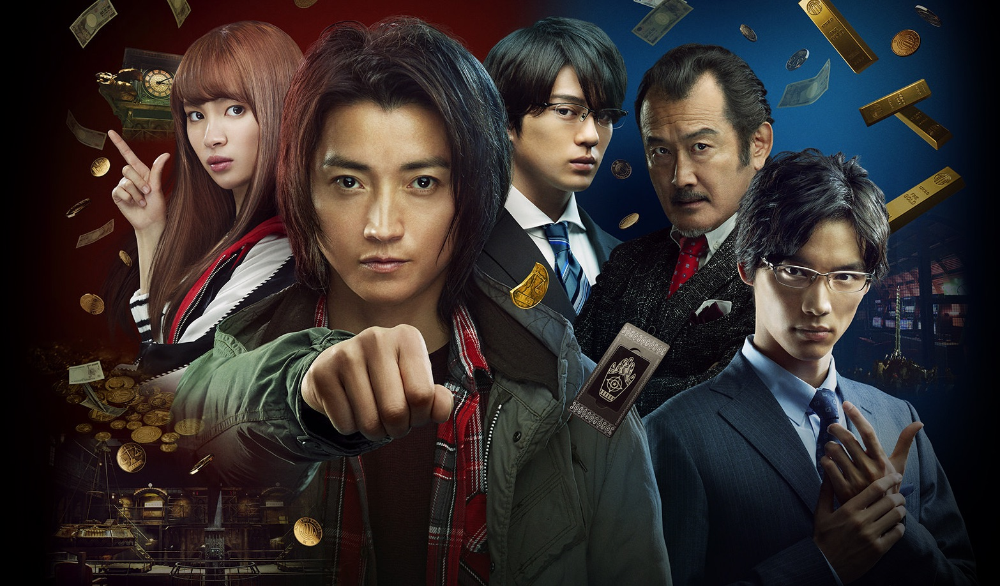

藤原竜也主演の劇場版実写カイジはやはり面白い

## カイジ -ファイナルゲーム-とは？
9年ぶりのスクリーン上映に加え、シリーズ最終回となる今作。  
これまでに2度映画化され、それぞれ大きなヒット作となっている。

そんななか、最終回となる今作では今までに出てきた数々の名ゲームもふんだんに登場する。
例えば1作目「カイジ人生逆転ゲーム」で大きく話題となったビルの間に渡された細い鉄骨を渡るゲームをオマージュした鉄骨を渡るシーンも登場する。

### あらすじ
<iframe width="560" height="315" src="https://www.youtube.com/embed/SJr0D8BwOvI" frameborder="0" allow="accelerometer; autoplay; encrypted-media; gyroscope; picture-in-picture" allowfullscreen></iframe>

> 2020年、国を挙げて盛大に開かれた東京オリンピックの終了を機に、この国の景気は恐ろしい速さで失速していった。  
> 今この国では、金を持つ強者だけが生き残り、金のない弱者は簡単に踏みつぶされ、身を寄せ合うことで何とか今を生きていた―。  
> 
> 自堕落な生活を送っていたカイジは、派遣会社からクズと罵られ、薄っぺらい給料袋を手渡される。憤りを感じながらも一缶千円に値上がりしたビールを買うかどうか迷っていた。

## 感想
やはり実写版の、いや藤原竜也が演技するカイジは面白い。そう思える演出の数々だった。~~相変わらずストーリーのテンポが気になるけど~~

今回作では4つのゲームで展開されている。
1. バレルの塔
2. 最後の審判~人間秤~
3. ドリームジャンプ
4. ゴールドジャンケン

それぞれ解説する。

### 1つ目のゲーム「バベルの塔」
急激なインフレで物価が高騰し、人々の生活はかなり厳しくなっている世の中で、金を持ち余している老人が遊戯の一つとして開催しているゲーム。
スタート地点でバベルの塔の場所が公表され、参加者が塔の頂上にある電卓を奪い合うというもの。この電卓には細工がしてあり最大で9億9999万円まで指定し引き出すことが可能になっている。一方この電卓の裏側には人生を変える極秘情報が書いてある魔法のキーを選択することもできる。  
選択できるのはどちらか一方のみ。

カイジはというと、事前にハンチョウから入手していた情報でバベルの塔が設置される場所に仕掛けを作り見事優勝する。  
そして「第1回目の優勝者は電卓を選択したが、刺殺されてしまったため危険だ。」ということで「魔法のキー」を選択する。。。

### 2つ目のゲーム「最後の審判~人間秤~」
「魔法のキー」により不動産王と呼ばれる東郷 滋のもとに行くカイジ。東郷は500億円もの資産を保有しているが、カイジに依頼する仕事には足りないので「10日で1000億に増やしてほしい」と懇願する。
ここまでの大金何に使うかというと、日本政府が検討している「個人資産凍結」を阻止するために政治家を買収するための資産にするためだという。もちろんカイジには何ら関係のない話に聞こえるが、この件に帝愛グループが関連していると聞き協力することとなる。  
一部の政治家はこの資産凍結前に現行の現金を新通貨へ換金することで一人勝ちしようとしているのだ。

2つ目のゲームのルールは実に簡単だ。
- 同程度の資産を保有している人間二人が戦う
- 敗者は即破産、勝者は資産を倍にすることができる。
- 勝敗にはそれぞれの陣営で金目の商品を提供し（家族・親友から提供してもらい）金へ換金する。
- 換金した金を秤に載せ秤が傾いた（重いほう）が勝者となる
- この勝敗をサポートするのは「Family」「Friend」「Fixer」に加えて、会場にいる人々「Fan」である。

カイジ曰く会場のFanにどれだけ投票してもらえるかが勝敗の鍵だという。

最初の換金でカイジ側は敵となる派遣業界の王、黒崎義裕と100億近い差を手に入れる。しかし味方の中にいた内通者により50億円の価値があるとされた港区の土地を暴落されるなどの邪魔をされる。  
そしてついには逆転までされてしまう。事前に用意しておいた10億円で逆転を豪うが難しい状況のため自らギャンブルを仕掛ける。

### 3つ目のゲーム「ドリームジャンプ」
10人のうち生き残れるのは1人のみのハイリスク・ハイリターンゲーム。  
ハズレを引けば即終了のこのゲームでは「事前に繋がれた命綱を選択する」必要がある。このことを聞いたカイジは手分けして作戦を仕組み見事勝利する。
10分の1の確率で勝利したカイジは10億の資金を100億円まで増加させた。

100億の資金を秤に加えてもなお届かない派遣王の前についに負けが確定したかと思われたが、奇跡的に追加された金貨で試合は微妙な形に。だが秤はまだ派遣王側に傾いている。

今度こそ負けかと思われたが、最後の追加1枚の金貨により逆転したカイジ。ついに試合に勝利した。

---
#### 【補足】金貨1枚でそんなに重さあるの？って思ったので調べてみた。
1枚の金貨(純金)は約30万円の価値があるらしい。作品内ではインフレが進んでいる（ビール一缶が1000円）
まずインフレ具合を検証する。
キリンラガービールは現在1缶が200円弱で取引されているのでざっくり作品内では5倍になっている。対して純金は2020/1月時点で1グラム6000円なので、5倍だと3万円となる。30万円分となると10g

つまり金貨1枚は10グラムしかない。

たった10グラムで秤を動かすことが可能か？？

---

### 4つ目のゲーム「ゴールドジャンケン」
手に入れた1000億円でカイジは個人資産凍結を阻止しようとするが、すでに時遅く法案が可決されていた。試合中に急死した不動産王の無念が悔やまれるが、印刷所を1000億で買収することに成功しなんとか政治家に新通貨を渡すことを防いだ。

防ぐだけで事足りないカイジはついに裏の総理と呼ばれている高倉浩介と直接対決することに。

ジャンケンのルール
- 3回勝負
- 1回でもカイジが勝てば勝利
- 3回のうち一回は必ずゴールドエッグを持って勝負しないといけない（つまりグーを出す必要がある）

1回目に勝負をつけないと勝つ確率が低くなるカイジは見事に手札を読まれてしまい負けてしまう。（手札：パー）  
2回目は1回目に使わなかったグーを出す必要があったのでこれも相手に読まれて負けてしまう（手札：グー）  
3回目、高倉はこのゲームでは負け無しの強い相手だという。純金でできたゴールドエッグは1つが2.5kgつまり作品内では7500万円の価値がある。  2.5kgを持った腕はいつもとは異なる特徴が現れるため高倉は相手がグー（ゴールドエッグを握っている）かどうかを判断することができる。カイジも読まれてしまうが、相手のグー＝ゴールドエッグを握っているという単純な思考のおかげで見事勝利する。

直接対決に勝利したカイジたちは色々あって個人資産凍結を阻止し。新通貨を先に手に入れようとした政治家たちを隠し撮りした映像を公開することで政治家を失脚させることも成功した。

---

2転3転4転くらいしてやっと完結したファイナルゲーム。やっぱり藤原竜也が演技するカイジは面白いなーと改めて思います。

p.s. 観終わった直後にブログを書くとめちゃくちゃ書けるな。。。

## INFO
公式サイト：https://kaiji-final-game.jp/

鑑賞日：2020/01/11