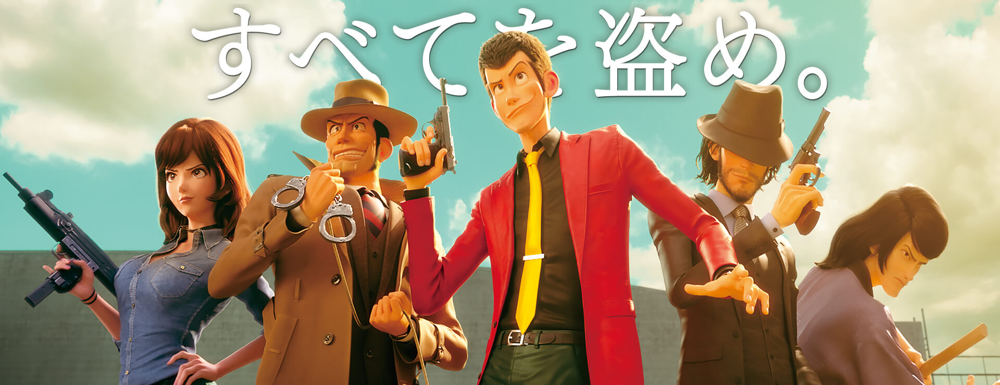

幼少期から好きなシリーズの一つであるルパン三世の新作映画が公開されました。  
今までとは異なり、3DCGアニメーションで制作されてます！

## ルパン三世 -ザ ファースト-とは？
不屈の名作である「ルパン三世　カリオストロの城」公開から40年を記念して制作された。  
原作者であるモンキー・パンチ氏が悲願していたという3DCGにて“23年ぶり”に劇場版が公開された。

日本のVFX第一人者である山崎貴 氏(STAND BY ME ドラえもん等)率いる制作陣で制作された。

### あらすじ
> かのアルセーヌ・ルパンが唯一盗むことに失敗した秘宝ブレッソン・ダイアリー。その謎を解き明かしたものは莫大な財宝を手にするといわれている。  
> そんな伝説のターゲットを狙うルパンは考古学を愛する少女レティシアと出会い、2人で協力して謎を解くことに......

## 感想
シリーズ初の3DCGで制作された The First  
率直な感想は「新しい」でした。

というのも3DCGで少し若く見えるルパンや、いつもより清潔に見える次元もさることながら、やはり迫力が段違いに凄い。  
爆破シーンや金属が（斬鉄剣で）切れるシーンがよりリアルな映像で楽しむことができる。

シナリオもいつものTVスペシャル以上に力が入っている。今回は舞台をパリ→メキシコ→ブラジルと移動しながら展開している。

敵役の“悪い感じ”もいつも以上に熱い。特にゲラルトはCV藤原竜也だけあり前半の調子に乗った発言や、後半の命乞いするシーンは必見だ。

最後に、いつもは揺れてないアレが揺れるのでリアルです。