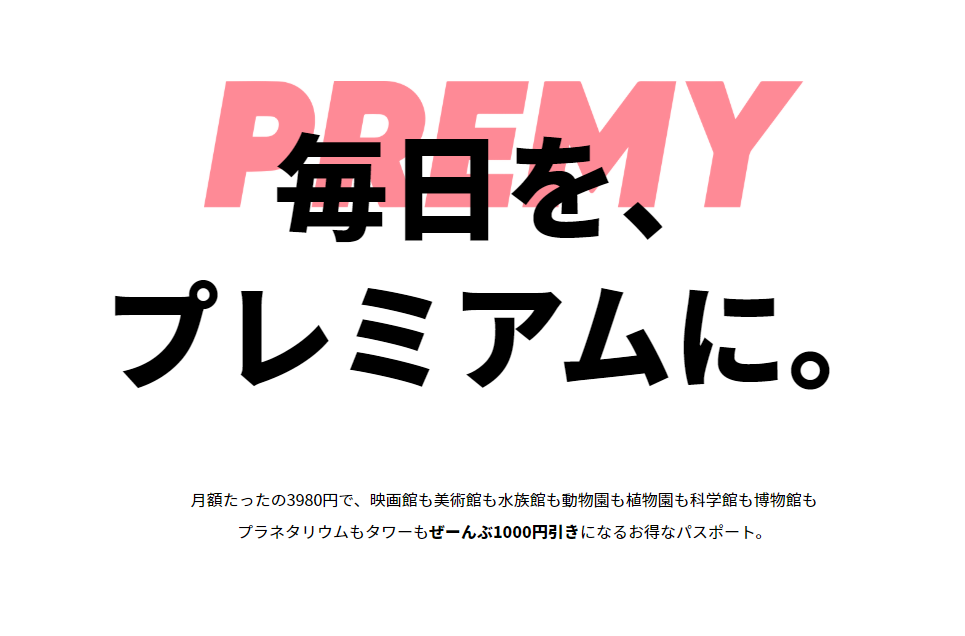

## TL;DR
- PREMYを提供するWED代表の山内氏により情報が公開された
- ONE app 内のお知らせでも情報が解禁された
- 「映画館」「美術館」「博物館」「水族館」に加えて **「動物園」** **「植物園」** **「科学館」** **「プラネタリウム」** **「タワー」**の施設料金をカバーする
- 半券買取価格が変更され最大1000円にて買取を行う
- 変更日は2020年2月22日

## PREMYがサービス内容の変更をするらしい
PREMYを提供するWED株式会社の代表である山内氏のTwitterにより意味深なツイートが行われた。

<blockquote class="twitter-tweet">
🤔 <a href="https://t.co/DXff1PuqOq">pic.twitter.com/DXff1PuqOq</a>
&mdash; 5Y (@5otoyam) <a href="https://twitter.com/5otoyam/status/1220352582863839232?ref_src=twsrc%5Etfw">January 23, 2020</a></blockquote> 

公式サイトの文面も変更されている。
> 月額たったの3980円で、映画館も美術館も水族館も動物園も植物園も科学館も博物館もプラネタリウムもタワーもぜーんぶ1000円引きになるお得なパスポート。

~~現在では施設ごとに定められた上限金額内にて半券を買取していたが、一律1,000円にて買取に変更される可能性がある。~~

### 収益性の悪化が原因か
月額3,980円にてサービスを提供するには難しい挑戦だろうと当初から考えられていた。映画の半券を1,900円にて買い取るというモデルは月に3回以上映画に行く人であれば月額料金を十分に回収することが可能である。アメリカでも似たようなサービスを提供するMoviePassという会社があったが破綻した。

PREMYも例外ではなく、現状のモデルでは資金が底を付く可能性がある。当初のモデルとはかけ離れてしまったが、現在は正式にサービスを展開しているのではなく　あくまでクローズドβテストだ。ビジネスモデルの再構築のため仕様が変更される。

今回の変更によってサービスが大幅に変更、制限される。

### 映画館は指定制へ
これまで、どこの映画館でも最大1,900円にて半券の買取を行っていたが、2020年2月22日以降は以下の店舗限定で半券を買い取る。
- TOHOシネマズ 全店舗
- UNITED CINEMAS 全店舗
- 松竹マルチプレックスシアターズ 全店舗
- AEON CINEMAS 全店舗

### 変更点

||これまで|これから|
|:-----:|:---:|:---:|
|月額料金|3980円|3980円|
|提供施設|映画館・美術館・水族館・博物館|（以前に加えて）動物園・植物園・科学館・プラネタリウム・タワー|
|キャッシュバック方法|半券買取|半券買取|
|買取価格|施設ごとに異なる(映画館なら1,900円)|最大1,000円買取|

