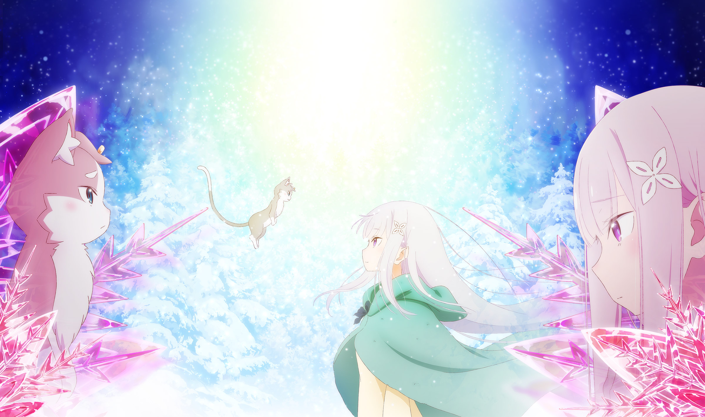

使い魔と銀髪少女の絆の物語がいま公開される

## Re:ゼロから始める異世界生活 氷結の絆 とは
Re:ゼロから始める異世界生活（以下 リゼロ）氷結の絆とは、銀髪の少女(魔女の特徴とされている)エミリアと猫のような姿の精霊（終焉の獣）パックが、どのような経緯で契約を結んだのかを描いた劇場映画。

### あらすじ
> 親竜王国ルグニカにあるエリオール大森林。それは人の干渉を拒絶する《氷結の森》。その溶けない雪と氷に覆われた森の奥に、一人の少女と一体の精霊が暮らしていた。二人に契約関係はなく、ただ成り行きで共に日常を過ごすだけ。互いの胸に秘めた罪悪感と使命感に急き立てられながら停滞した時間。  
> 触れ合える距離にありながら、決して寄り添うことのない二人に、運命は容赦なく、全てを焼き尽くす業火となって襲い来る。

## 感想
Re:ゼロから始める異世界生活 シリーズはTVアニメと前作のOVAみたいな劇場版しか観たことなかったが、今回の作品は放送が決定している2期に繋がる重要な作品だった。

今回のテーマ「エミリアの過去と、パックとの契約までの経緯」は新しい情報を大量に手に入れることができた。

例えば以下の真実
- なぜエミリアは一人ぼっちだったのか
- エミリアの銀髪が嫉妬の魔女の特徴だと気がついた経緯
- パックがエミリアを娘という理由
- 終焉の獣とは

スバルが出てこない世界での二人の関係を描いた作品だったので、いい意味でも悪い意味で(~~悪い意味でも~~)スバルのCVである小林裕介さんの声が聞こえなかったのは良いと思う。

## INFO
[公式サイト](http://re-zero-anime.jp/hyoketsu/)

鑑賞日：2019/12/16