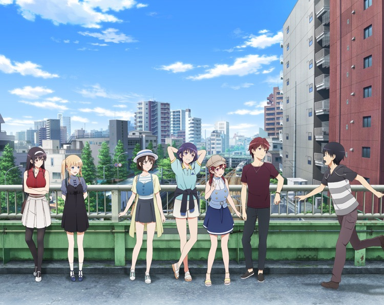

本当のメインヒロインが誕生する。

## 冴えない彼女の育て方 -fine- とは？
富士見ファンタジア文庫にて連載されているライトノベル原作のシリーズ。

高校生の主人公　安芸倫也が発足させた同人ゲーム制作サークルがコミケ参加を目指して活動する姿を描いた作品。  
これまでに2度アニメ化された。

- 1期 13話編成（原作1~4巻）
- 2期 12話編成（原作5~7巻）

この劇場版では原作8~13巻のメインストーリーを全て回収する。

### あらすじ
<iframe width="1176" height="662" src="https://www.youtube.com/embed/_8v3CsHJsSo" frameborder="0" allow="accelerometer; autoplay; encrypted-media; gyroscope; picture-in-picture" allowfullscreen></iframe>

## 感想
fine の鑑賞は諸事情により30分遅れて映画館に入ったため、冒頭30分は観ていないです。  
しかし、冒頭の30分アニメ1,2期を見ていればなんとなく想像がつく展開をしていたので、問題なかったです。

---

英梨々と詩羽がマルズに引き抜かれて少し経ったころ無事に倫也くんと恵が仕事上付き合うこととなった。そしてゲーム制作を続けていったが対するマルズの紅坂朱音が(仕事のしすぎで)倒れてしまう。  
倫也としては新生blessing softwareのゲームもマルズの「絶対に売れる、面白い」とされる超大作「フィールズ・クロニクル」の成功も願ってしまい、自らの仕事を投げ出しマルズの制作を進める。

倫也くんのこの行動で新生blessing softwareが制作していた新作ゲームは期限前にも関わらず制作がストップしてしまう。

なんとかギリギリ フィールズ・クロニクルのマスターアップをした倫也は新生blessing softwareに戻ってくるが恵は顔も合わしてくれない。。。

---

エンディング後の茶番と大人になった皆の姿に泣けました(´；ω；｀)

## INFO
[公式サイト](https://saenai-movie.com/)

鑑賞日：2019/12/14